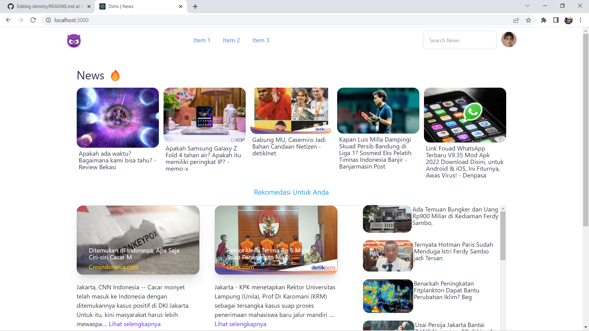

## 💙💙
Sebuah Web Portal berita yang menyediakan berita" di Indonesia dari berbagai sumber .\
yang di buat mengunakana Public APIs

## Note 🗒️
* APi tidak di perbolehkan kecuali localhost :(
## What Use 👾
* <a href="https://reactjs.org/">React js</a> Library
* <a href="https://www.npmjs.com/package/react-axios">Axios</a> For Fetching APi
* Loading <a href="https://www.npmjs.com/package/react-loading-skeleton">Skeleton</a> React
* <a href="https://tailwindcss.com/">TailwindCSS</a> For styling
* <a href="https://www.npmjs.com/package/react-daisyui">Dasyui</a> React

## ⭐
* Ya 💙

### `npm install`
install modules 

### `npm start `
for start the project
### `npm run build`

Builds the app for production to the `build` folder.\
It correctly bundles React in production mode and optimizes the build for the best performance.

The build is minified and the filenames include the hashes.\
Your app is ready to be deployed!

See the section about [deployment](https://facebook.github.io/create-react-app/docs/deployment) for more information.
## Learn More

You can learn more in the [Create React App documentation](https://facebook.github.io/create-react-app/docs/getting-started).

To learn React, check out the [React documentation](https://reactjs.org/).

### Deployment

This section has moved here: [https://facebook.github.io/create-react-app/docs/deployment](https://facebook.github.io/create-react-app/docs/deployment)

## 💙

